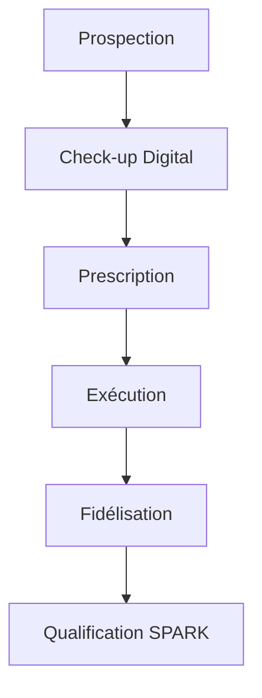
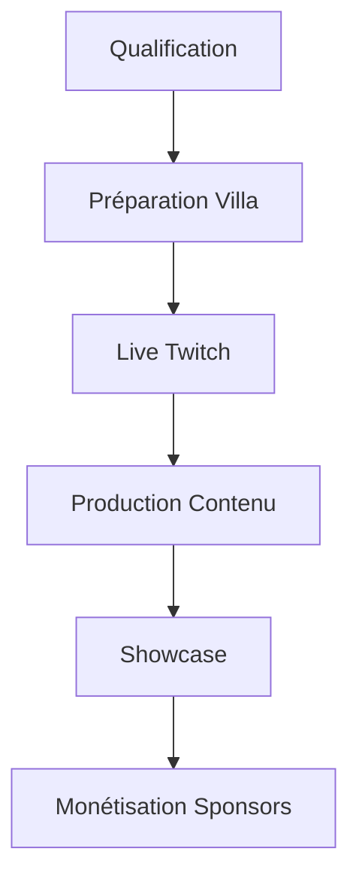

# MONA x SPARK — Bible Opérationnelle (Règles Projet)

## Philosophie Globale
- **Cibler** : Artistes/créateurs sans vision business
- **Approche** : Diagnostic immédiat, résultats rapides, structuration progressive, monétisation collective
- **Modèle** : Revente audience qualifiée à sponsors/marques culturelles

---

## 1. MONA – Starter Business Créatif

### Objectif
Visibilité comme porte d'entrée vers structuration/monétisation

### Cible
- Artistes sans équipe ni plan
- 1K–15K followers
- Autoproduction

### Offres
- **MONA 290** : Campagne marketing rapide, résultats immédiats
- **MONA 390** : Audit, éditorialité, social kit, plan de contenu
- **MONA 490+** : Accompagnement long terme, sponsors, coaching

### Process
1. **Prospection ciblée** → 2. **Check-up digital** → 3. **Prescription stratégique** → 4. **Exécution rapide** → 5. **Fidélisation**

### Équipe
- Coach artistique
- Social strategist
- Graphiste
- Community runner
- Coordinateur

### Assets à créer
- Grille check-up
- Templates mails/DM
- Social kit
- Calendrier éditorial
- Ordonnance stratégique
- Dashboard clients

---

## 2. SPARK – Acte Collectif

### Objectif
Plateforme de contenus viraux/collectifs pour visibilité et sponsors

### Cible
- Artistes passés par MONA
- Créateurs prêts pour collab/viral

### Format
- 1 semaine villa créative/mois
- Twitch live
- Mini-docu
- Reels
- Showcase final

### Modèle économique
- Sponsors
- Coproduction
- Abonnements/donations
- Billetterie

### Lien MONA → SPARK → Sponsoring
Création talents → Rassemblement → Vente audience à sponsors

### Assets à produire
- Dossier sponsor
- Charte visuelle
- Templates TikTok/reels
- Calendrier séjour
- Planning caméra/storytelling

---

## 3. Roadmap Mensuelle

### Semaine 1–2
- Prospection/conversion MONA

### Semaine 3
- Exécution MONA 390/490

### Semaine 4
- SPARK (live/docu/capsules/showcase)

### +15 jours
- Retours sponsors/analyses/signatures

---

## 4. Architecture Technique (Haute Performance)

### Frontend
- **Next.js/React (SSR + ISR)** : landing, dashboard
- **PWA** : offline-first, notifications push
- **Micro-frontends** : modules indépendants

### Backend
- **Architecture Hexagonale** : core domain séparé
- **API GraphQL/REST hybride** : endpoints optimisés
- **Microservices Go/Rust** : haute performance
- **Edge Functions** : traitement géo-distribué

### Data & IA
- **PostgreSQL** : core data avec partitionnement
- **Redis** : cache, queues, pub/sub temps réel
- **Vector DB** : embedding IA pour similarité profils
- **LLM fine-tuné** : scoring prédictif, génération copywriting

### Infrastructure
- **Kubernetes** : autoscaling, high availability
- **Message Broker** : Kafka/NATS pour event-sourcing
- **CDN** : assets statiques distribués globalement

---

## 5. Process Event-Driven

### Data Ingestion Layer (99.99% disponibilité)
- Multi-source ETL
- Circuit Breakers
- Data Validation
- Embeddings Storage

### Core Intelligence Layer (inférence <50ms)
- ML Pipeline auto-optimisante
- Transfer Learning
- Feature Store
- Explainable AI

### Orchestration Layer (scalabilité horizontale)
- Event Sourcing
- CQRS Pattern
- Saga Pattern
- Backpressure Management

### Interaction Layer (latence <100ms)
- Edge Computing
- Progressive Enhancement
- Offline First
- SSR + Hydration

### Business Layer (insights temps réel)
- Anomaly Detection
- Predictive Analytics
- Smart Alerting
- Revenue Optimization

---

## 6. Métriques & KPIs

### Métriques Techniques
- **MTTR** : < 5 minutes
- **Taux de disponibilité** : 99.99%
- **Latence API** : p95 < 100ms
- **Cold start landing page** : < 1.5s

### Métriques Business
- **Coût acquisition artiste** : < 18€
- **Taux conversion landing → inscription** : > 25%
- **Temps onboarding** : < 2min30s
- **NPS** : > 70
- **LTV/CAC ratio** : > 5x

---

## 7. Règles Projet

### Règle #1 : Philosophie Respect
Toute évolution du code/service doit respecter cette philosophie et roadmap.

### Règle #2 : Assets Prioritaires
Les assets listés sont prioritaires à automatiser ou digitaliser.

### Règle #3 : Maximisation Impact
Toute fonctionnalité doit viser à maximiser :
- Impact rapide
- Structuration progressive
- Monétisation collective

### Règle #4 : Performance Serveur
Pour la stack Tulz (Hostinger Cloud Startup) :
- Ne jamais dépasser 80% des capacités serveur
- Alerte dès que ce seuil est atteint
- S'applique à tous les outils et micro-SaaS

### Règle #5 : Design "Less is More"
- Approche intuitive
- Interface épurée
- Expérience utilisateur fluide

---

## 8. Workflows Automatisés

### MONA Workflow

### SPARK Workflow

---

## 9. Monitoring & Alertes

### Alertes Critiques
- Seuil 80% ressources serveur
- Taux conversion < 20%
- Latence API > 100ms
- Disponibilité < 99.9%

### Dashboards Temps Réel
- Performance business
- Métriques techniques
- ROI par canal
- Satisfaction client

---

*Cette bible opérationnelle garantit l'alignement de toutes les actions avec la vision MONA x SPARK, optimisant chaque interaction pour maximiser l'impact et la monétisation collective.* 