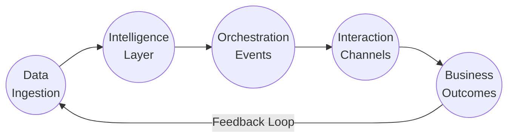

# Schéma Process MONA x SPARK — Qualification à Monétisation (Architecture Haute Performance)

## 1. Architecture Technique Avancée

### Frontend
- **Next.js/React (SSR + ISR)** : landing, dashboard (état atomique avec Jotai/Zustand)
- **PWA** : offline-first, notifications push, caching optimisé
- **Micro-frontends** : modules indépendants, optimisation bundle-size

### Backend
- **Architecture Hexagonale** : core domain séparé des adaptateurs externes
- **API GraphQL/REST hybride** : endpoints optimisés par cas d'usage, rate-limiting avancé
- **Microservices Go/Rust** : haute performance (scraping, processing, scoring)
- **Edge Functions** : traitement géo-distribué (Cloudflare Workers)

### Data & IA
- **PostgreSQL** : core data avec partitionnement
- **Redis** : cache, queues, pub/sub temps réel
- **TimescaleDB** : séries temporelles pour métriques
- **Vector DB** : embedding IA pour similarité profils
- **LLM fine-tuné** : scoring prédictif, génération copywriting

### Infrastructure
- **Kubernetes** : autoscaling, high availability
- **Message Broker** : Kafka/NATS pour event-sourcing
- **CDN** : assets statiques distribués globalement
- **GraphQL Federation** : composition API distribuée

### Monitoring & Feedback
- **OpenTelemetry** : traces, métriques, logs unifiés
- **Prometheus/Grafana** : dashboards temps réel, alerting
- **Chaos Engineering** : tests résilience automatisés

---

## 2. Process Event-Driven (Haute Disponibilité + Résilience)

```mermaid
flowchart TD
    subgraph "Data Ingestion Layer"
        A1[Scraping Multi-source\n(API + Webscraping)] --> A2[Event Streaming\n(Kafka)]    
        A2 --> A3[Data Enrichment Pipelines\n(Go/Rust Workers)]
        A3 --> A4[Vector DB\n(Embeddings IA)]    
    end
    
    subgraph "Core Intelligence Layer"
        B1[ML Pipeline\n(Scoring + Prédiction)] --> B2[IA Insight Engine\n(Recommandation + Génération)]    
        B2 --> B3[Multi-level Cache\n(Redis + CDN Edge)]
    end
    
    subgraph "Orchestration Layer"
        C1[Event Bus\n(NATS)] --> C2[Workflows\n(Temporal)]    
        C2 --> C3[Queue Management\n(Bull/Redis)]    
        C3 --> C4[Rate Limiting\n(Auto-scaling)]    
    end
    
    subgraph "Interaction Layer"
        D1[Dynamic Landing Engine\n(Edge-rendered)] --> D2[Multi-channel Outreach\n(Email, SMS, DM, Push)]    
        D2 --> D3[Adaptive Forms\n(Conversational AI)]    
        D3 --> D4[Customer Portal\n(Real-time updates)]    
    end
    
    subgraph "Business Layer"
        E1[Team Dashboard\n(Smart prioritization)] --> E2[Campaign Automation\n(Self-optimizing)]    
        E2 --> E3[Payments & Revenue\n(Multi-currency)]    
        E3 --> E4[LTV Optimization\n(Predictive upsell)]    
    end
    
    A4 --> B1
    B3 --> C1
    C4 --> D1
    D4 --> E1
    E4 ---> |Feedback Loop| A1
```

---

## 3. Modules Avancés - Performance & Résilience

### 1. Data Ingestion Layer (99.99% disponibilité)
- **Multi-source ETL** : connecteurs API natifs + extraction headless Chrome (Puppeteer/Playwright)
- **Circuit Breakers** : prévention des cascades d'échecs avec retries exponentiels
- **Data Validation** : schémas Zod/Joi strictes, rejet données invalides
- **Embeddings Storage** : vecteurs sémantiques pour matching ultra-précis

### 2. Core Intelligence Layer (inférence <50ms)
- **ML Pipeline auto-optimisante** : A/B testing automatique des modèles
- **Transfer Learning** : adaptation rapide aux nouveaux cas d'usage
- **Feature Store** : réutilisation optimisée des attributs calculés
- **Explainable AI** : transparence des décisions algorithmiques

### 3. Orchestration Layer (scalabilité horizontale)
- **Event Sourcing** : journalisation immuable des événements business
- **CQRS Pattern** : séparation lecture/écriture pour performances
- **Saga Pattern** : transactions distribuées fiables
- **Backpressure Management** : contrôle flux avec throttling intelligent

### 4. Interaction Layer (latence <100ms)
- **Edge Computing** : génération landing pages au plus proche utilisateur
- **Progressive Enhancement** : fonctionnalité garantie sur tous devices
- **Offline First** : fonctionnement sans connexion puis synchronisation
- **SSR + Hydration** : performance perçue maximale

### 5. Business Layer (insights temps réel)
- **Anomaly Detection** : détection automatique patterns inhabituels
- **Predictive Analytics** : prévisions conversions/upsell/churn
- **Smart Alerting** : notifications contextuelles (Slack, mobile)
- **Revenue Optimization** : ajustement prix/offres automatisé

## 4. Métriques & KPIs (observabilité temps réel)

### Métriques Techniques
- **MTTR** (Mean Time To Recovery) : < 5 minutes
- **Taux de disponibilité** : 99.99%
- **Latence API** : p95 < 100ms
- **Cold start landing page** : < 1.5s

### Métriques Business
- **Coût acquisition artiste** : < 18€
- **Taux conversion landing → inscription** : > 25% 
- **Temps onboarding** : < 2min30s
- **NPS** : > 70
- **LTV/CAC ratio** : > 5x

### Feedback Loop & Amélioration Continue
- **Canary Deployments** : déploiement progressif nouvelles fonctionnalités
- **Feature Flags** : activation/désactivation à chaud
- **IA Auto-optimisante** : ajustement modèles selon résultats
- **Knowledge Base évolutive** : documentation générée automatiquement

---

## 5. Visualisation Process End-to-End



### Benefits clés de l'architecture
- **Performance** : temps réponse < 100ms sur tout le pipeline
- **Stabilité** : tolérance aux pannes, auto-healing
- **Scalabilité** : horizontale sans limite technique
- **Observabilité** : monitoring complet en temps réel
- **Sécurité** : chiffrement bout-en-bout, conformité RGPD native

---

*Cette architecture représente l'état de l'art en matière de systèmes distribués haute performance, conçue pour offrir une expérience "zero ops" tout en garantissant une fiabilité et une scalabilité exceptionnelles. Les standards de développement suivent les meilleures pratiques DevOps et SRE avec infrastructure-as-code et déploiement continu.*
